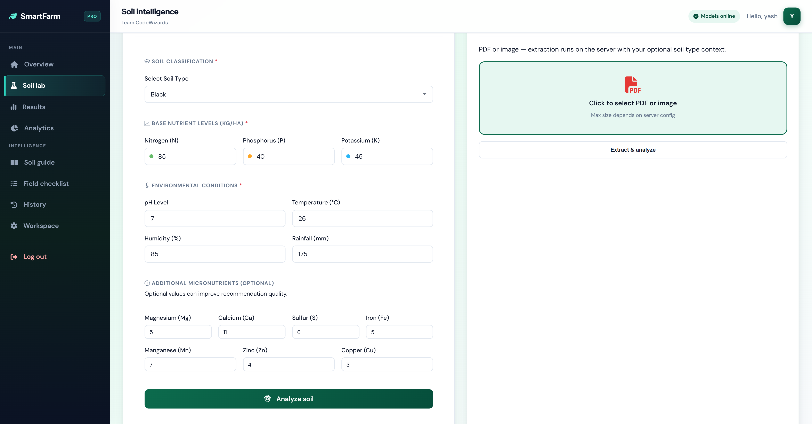
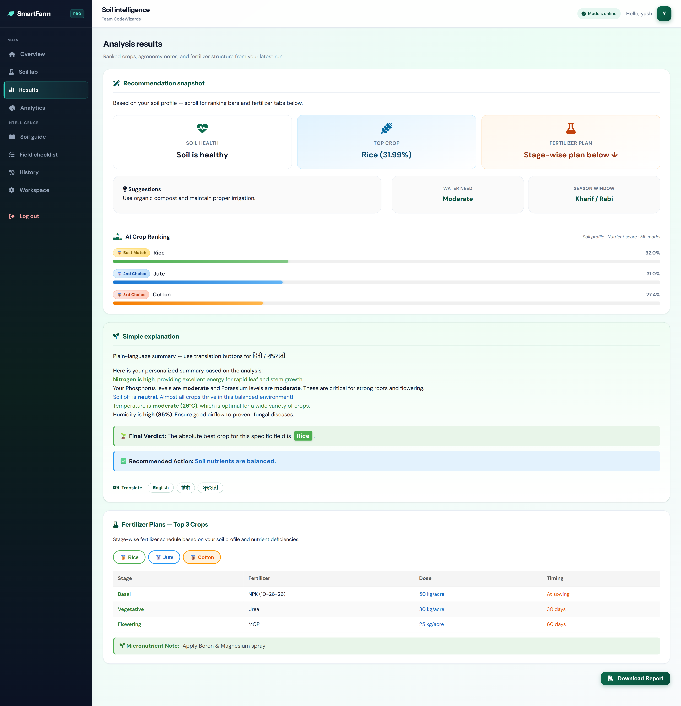
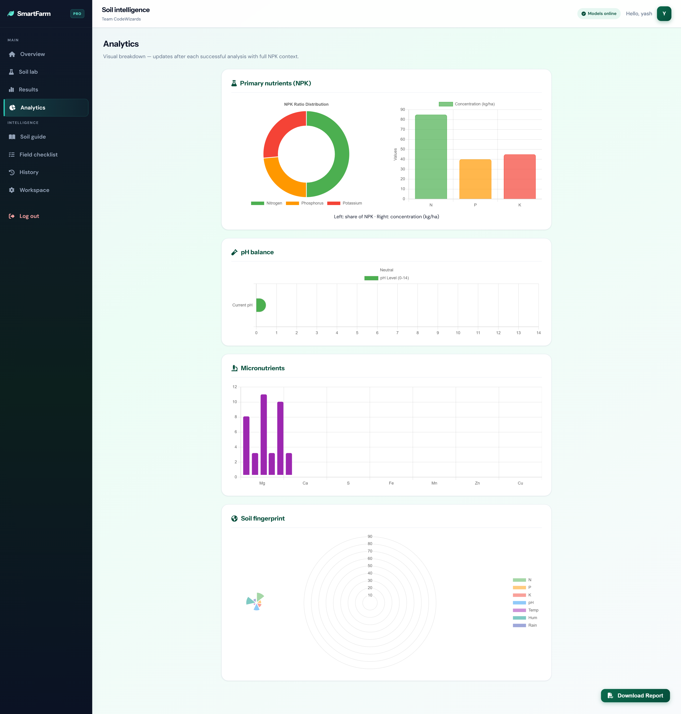
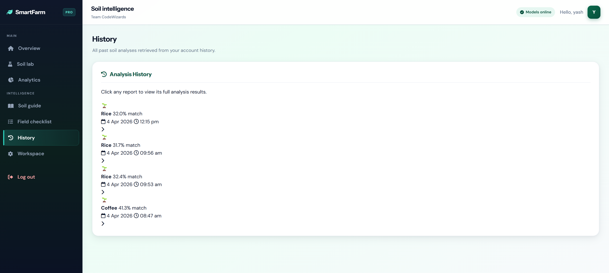
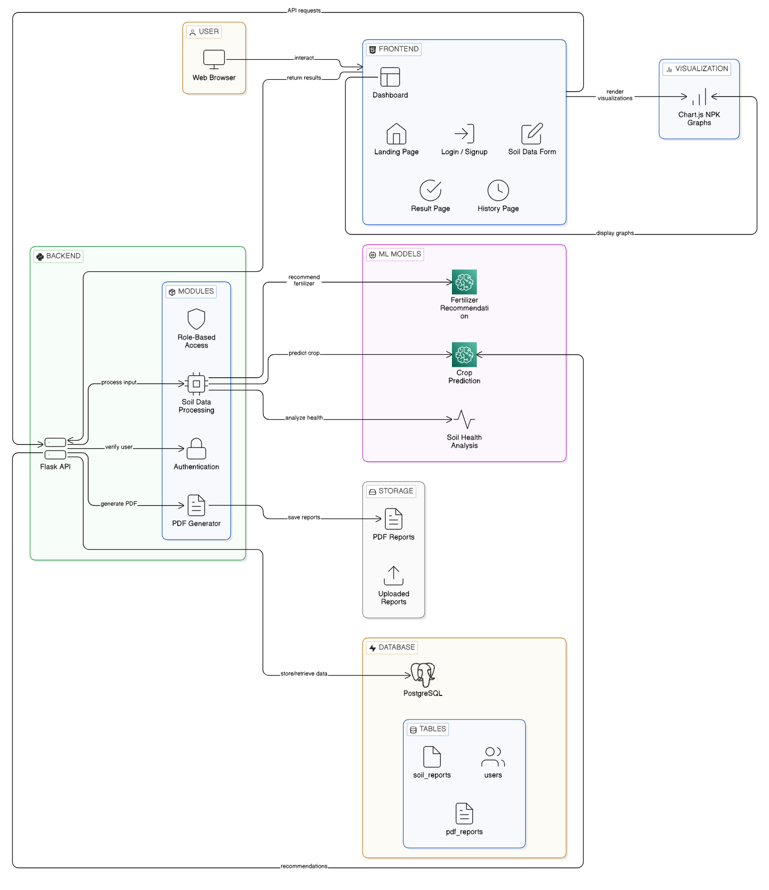
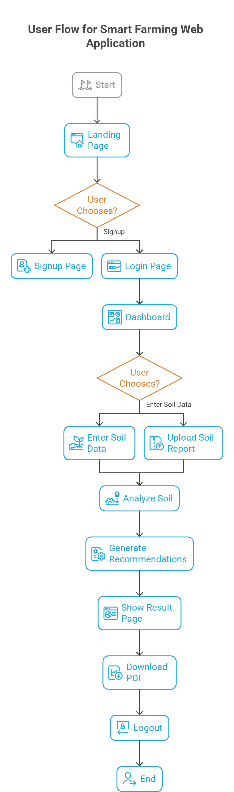

# 🌱 CodeWizards Smart Farming

CodeWizards Smart Farming is an intelligent web application designed to help farmers make data-driven decisions. By analyzing soil metrics and environmental factors, this system empowers users with customized crop recommendations, detailed fertilizer planning, and soil health analysis.

--- 

## ✨ Key Features

- **📄 Automated Data Entry**: Upload your soil report PDFs and let the app automatically extract data (NPK values, pH, etc.).
- **🌾 Crop Recommendation**: Employs Machine Learning to suggest the top 3 optimal crops based on soil nutrient profile and conditions.
- **🧪 Fertilizer Planning**: Generates customized fertilizer requirement plans considering specific micronutrient deficiencies.
- **📊 Soil Health Dashboard**: Interactive, visual charts to track your soil's health metrics over time.
- **📥 Downloadable Reports**: Automatically generates and lets you download comprehensive PDF reports of your soil analysis.
- **🔐 User Authentication & History**: Secure login/signup system with a complete history of past soil tests and recommendations.

---
**Landing  page**


**Manual input**


**Result**


**Chart**


**History**


**Architecture**

<!--  -->

## 💻 Tech Stack

- **Backend**: Python, Flask
- **Frontend**: HTML5, CSS3, JavaScript
- **Machine Learning**: Scikit-learn, Numpy
- **Database**: MongoDB
- **PDF Processing**: `pdfkit`, `wkhtmltopdf`

---

## 🚀 How to Run the Project Locally

Follow these simple steps to set up the project on your local machine:

### Prerequisites

1. **Python**: Ensure you have Python installed on your system. You can check by running `python --version` in your terminal.
2. **MongoDB**: You need a MongoDB instance (local or MongoDB Atlas URL).
3. **wkhtmltopdf**: Install [wkhtmltopdf](https://wkhtmltopdf.org/downloads.html). Make sure it's installed at `C:\Program Files\wkhtmltopdf\bin\wkhtmltopdf.exe` (or optionally update its path in `backend/app.py`).

### Setup Steps

**1. Open terminal in your System and navigate to the backend directory:**
```bash
cd backend
```

**2. Set up Environment Variables:**
Create a `.env` file in the `backend` folder and add your MongoDB connection details:
```env
MONGO_URI=your_mongodb_connection_string
DATABASE_NAME=smart_farming
```
 
**3. Install the dependencies:**
```bash
pip install --upgrade pip
pip install -r requirements.txt
```

**4. Run the Flask application:**
```bash
python app.py
```

**5. Open your browser:**
Navigate to [http://127.0.0.1:5000](http://127.0.0.1:5000) to access the application!

---

💡 *Happy Farming!*